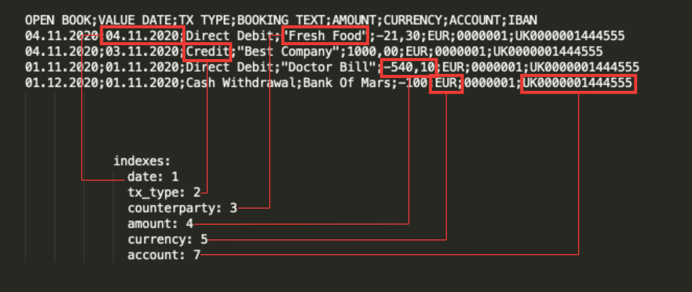

# Beanborg tutorial

This tutorial guides the user through the steps required to import financial transactions from a fictional bank (Eagle Bank) into an existing Beancount ledger, using [Beanborg](https://github.com/luciano-fiandesio/beanborg).

## Initial setup

The tutorial is based on an existing Beancount setup, structred like [so](https://github.com/luciano-fiandesio/beanborg/tree/master/tutorial):

```
accounts.ldg
main.ldg
  |
  |__ UK0000001444555.ldg
```

To get started, simply clone the [Beanborg](https://github.com/luciano-fiandesio/beanborg) repository and follow the installation steps.

```
git clone https://github.com/luciano-fiandesio/beanborg

cd beanborg/tutorial
```

It is also probably a good idea to take a quick look at the project's [README](https://github.com/luciano-fiandesio/beanborg/blob/master/README.md), to get an idea of the Beanborg workflow and understand the various configuration options.

The goal of this tutorial is to be able to import the transactions from the [sample CSV](https://github.com/luciano-fiandesio/beanborg/blob/master/README.md) file into the ledger-managed `UK0000001444555.ldg` file.

## Creating a configuration file for Eagle bank

Beanborg requires a configuration file for each type of CSV file that we wish to import. 
Normally, each CSV file is bound to a financial institution, so it's good practice to name our config file after the bank. In this case, `eagle.yaml`. I prefer to keep configuration files in a dedicated folder.

Let's create a new folder where we will store the import configuraton.

```
mkdir config
```

Create a new `eagle.yaml` file in the `config` folder.

Now, let's open the fictional CSV file, located in the `test-data` folder. It is important to understand the structure of the CSV file in order to configure Beanborg properly.

```
OPEN BOOK;VALUE DATE;TX TYPE;BOOKING TEXT;AMOUNT;CURRENCY;ACCOUNT;IBAN
04.11.2020;04.11.2020;Direct Debit;"Fresh Food";-21,30;EUR;0000001;UK0000001444555
04.11.2020;03.11.2020;Credit;"Best Company";1000,00;EUR;0000001;UK0000001444555
01.11.2020;01.11.2020;Direct Debit;"Doctor Bill";-540,10;EUR;0000001;UK0000001444555
01.12.2020;01.11.2020;Cash Withdrawal;Bank Of Mars;-100;EUR;0000001;UK0000001444555
```

By observing the CSV file, we can determine the following information:

- we want to skip the first line
- the field delimiter uses the `;` character rather than the more standard comma
- the currency separator uses the `,` character rather than the more standard `.`
- the date format uses day, month and year, separated by a dot.
- in order to match the ledger file `UK0000001444555.ldg` to this account we can use the `IBAN` field of the CSV file

Let's start creating the configuration file for Eagle Bank. Paste the following snippet in the previously created file,`eagle.yaml`:


```
--- !Config
csv:
   download_path: !CHANGE ME!
   name: eagle
   bank_ref: eag
   separator: ';'
   date_format: "%d.%m.%Y"
   currency_sep: ","
```

During a normal import operation, the CSV file is downloaded from the bank app - mobile or web and placed in a download folder. For the sake of the tutorial, you can copy the file `eagle-bank-statement.csv` to your Downloads folder and replace `!CHANGE ME` with the path to the folder, e.g. `/Users/tom/Downloads`.

Let's look at this initial configuration.
The `name` property is required to find the CSV file in the path specified by the `download_path` property. It is enough to specify the first letters of the CSV file, without the `csv` extension.

The `bank_ref` property is very important, because it is used by Beanborg to rename the CSV file and move it to the staging area. If one has multiple bank accounts to import, it is important that the value of `bank_ref` is unique.

The `date_format`, `separator` and `currency_sep` should be self-explanatory.

We don't need to specify the `skip` property, since the default value is `1`.

Let's try to import the CVS file into the working area, using `bb_mover.py`.

// TODO screencast

## Add the mapping information and rules to the configuration file

In order to successfully import the transaction from Eagle Bank into our ledger, we need to supply some more information to Beanborg: CSV mapping info and rules.

Append the following configuration to the `eagle.yaml` file:

```
indexes:
    date: 1
    tx_type: 2
    counterparty: 3 
    amount: 4
    currency: 5
    account: 7
```

With this block of configuration we are instructing Beanborg about the data within our CSV file.
This image should hopefully makes the concept more clear:



Beanborg is now able to map the most relevant information of the CSV file with the Beancount structure and create a valid transaction.

The last section of the configuration relates to rules. 

Rules can be considered as a list of "actions" that are executed one after the other and are applied to each row of the CSV file we want to import.

There are different type of rules: some can be used to change the Accounts of a transaction or ignore a specific transaction.

Let's focus on a simple rule, that will assign the correct Expense to each transaction in our CSV file. 


Append the following configuration to the `eagle.yaml` file:

```
rules:
  ruleset:
    - name: Replace_Expense
```

It's now time to run the second Beanborg script, `bb_import.csv`, which imports the transaction into the ledger.

```
bb_import.csv -f config/eagle.yaml
```

The script should exit immediately with the following error:

```
The rule folder 'rules' does not exist!
```

The `Replace_Expense` rules requires an additional look-up table file to map counterparty names to Expense categories.
This file (named `.rules`) should be located in a folder named `rules` - note that this name can be changed using the `rules_folder` property of the `rules` configuration.

Let's create a `rules` folder:

```
mkdir rules
```